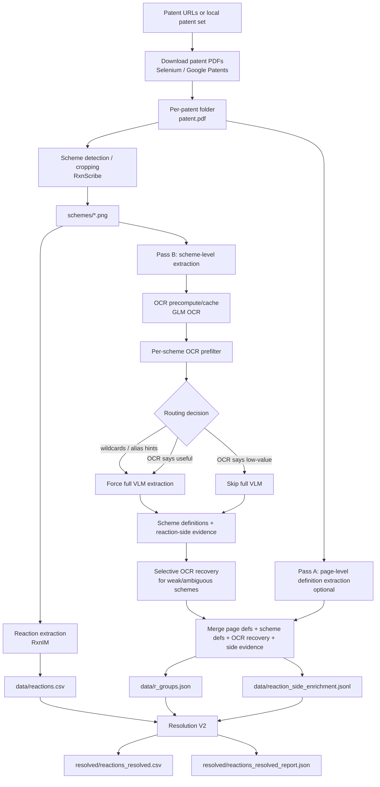

# OCR-Enabled Extraction Pipeline Flow

This is the actual OCR-enabled extraction flow in the current setup.

Relevant scripts:
- `/home/boltzmann19/joel/full_pipeline_optimized_transfer/full_pipeline_optimized.py`
- `/home/boltzmann19/joel/r_group_pipeline/run_r_group_extraction_and_resolution_v2.py`
- `/home/boltzmann19/joel/r_group_pipeline/precompute_scheme_ocr_cache.py`
- `/home/boltzmann19/joel/r_group_pipeline/extract_r_groups_v2.py`

## End-to-End Flow



## What Each Stage Does

1. `rxnim` env:
   - download patents
   - crop reaction schemes from `patent.pdf`
   - run RxnIM on `schemes/*.png`
   - write `data/reactions.csv`

2. `patent_extraction` env:
   - read `patent.pdf`, `schemes/*.png`, `data/reactions.csv`
   - run OCR-enabled R-group extraction
   - write `data/r_groups.json` and `data/reaction_side_enrichment.jsonl`

3. `patent_extraction` env:
   - resolve placeholders in `data/reactions.csv`
   - write final `resolved/reactions_resolved.csv`

## Where OCR Is Actually Used

OCR is only in the R-group extraction stage, not in RxnIM reaction extraction.

It is used in three places:
- OCR precompute/cache on scheme PNGs
- OCR prefilter to decide whether a scheme needs full VLM extraction
- selective OCR recovery on weak or ambiguous schemes

## Benchmark-Specific Note

For the current OCR vs no-OCR benchmark, the upstream part is already fixed:
- `patent.pdf`
- `schemes/*.png`
- `data/reactions.csv`

So the benchmark reruns only this part:

```text
schemes/*.png + reactions.csv
-> OCR prefilter / OCR recovery / VLM extraction
-> r_groups.json + reaction_side_enrichment.jsonl
-> reactions_resolved.csv
```

That is why the benchmark isolates the OCR effect on R-group extraction/resolution, not on patent download or RxnIM reaction extraction.
