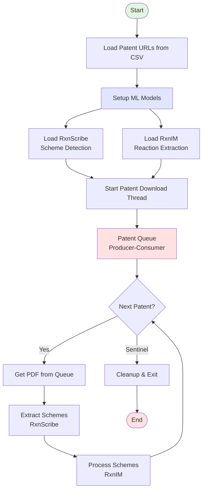
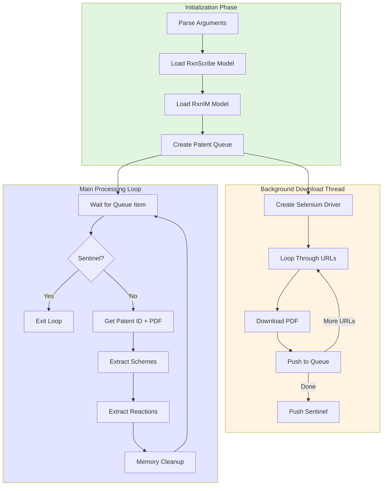
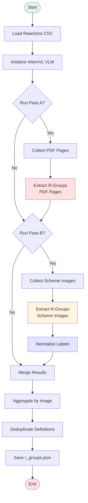
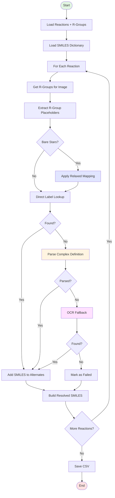
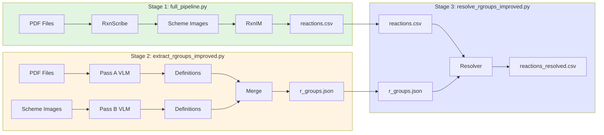

# Patent R-Group Extraction & Resolution Pipeline

## Overview

This pipeline extracts chemical reactions from patents with special handling for R-group placeholders (variable substituents like R1, R2, etc.). It consists of three main scripts:

1. **[full_pipeline.py](full_pipeline.py)** - Main orchestration script
2. **[extract_rgroups_improved.py](extract_rgroups_improved.py)** - VLM-based R-group definition extraction
3. **[resolve_rgroups_improved.py](resolve_rgroups_improved.py)** - SMILES-based R-group resolution

---

## 1. Full Pipeline Architecture



### 1.1 Input/Output Summary

| Stage | Input | Output |
|-------|-------|--------|
| **Patent Download** | Patent URLs (CSV) | PDF files per patent |
| **Scheme Extraction** | PDF pages | Cropped scheme images (PNG) |
| **Reaction Extraction** | Scheme images | Reaction SMILES + R-group labels |
| **R-Group Extraction** | PDF pages + scheme images | R-group definitions (JSON) |
| **R-Group Resolution** | Reactions + definitions | Resolved SMILES (CSV) |

---

## 2. Script 1: full_pipeline.py

### 2.1 Flow Diagram



### 2.2 Key Features

| Feature | Description |
|---------|-------------|
| **Producer-Consumer Pattern** | Downloads patents in background thread while processing completes |
| **Chunk-based Processing** | Processes PDF pages in chunks (16 pages) to limit memory |
| **Parallel Rendering** | ThreadPoolExecutor for PDF page rendering (max 4 workers) |
| **Checkpoint Support** | Skips already processed patents |
| **Batch Inference** | Configurable batch size for model inference |

### 2.3 Configuration

```python
# File: full_pipeline.py:39-57
DOWNLOAD_DIR = "/mnt/boltzmann/boltzmann_data/patent_extraction/pipeline_output_all_rxnim"
RXNSCRIBE_MODEL_PATH = "/mnt/boltzmann/boltzmann_data/patent_extraction/rxnscribe_model.ckpt"
RXNIM_MODEL_PATH = "/mnt/boltzmann/boltzmann_data/patent_extract_hf/RxnIM/rxn/model/model.ckpt"
```

---

## 3. Script 2: extract_rgroups_improved.py

### 3.1 Flow Diagram



### 3.2 Two-Pass Architecture

| Pass | Input | Purpose | Output |
|------|-------|---------|--------|
| **Pass A** | PDF pages | Extract R-group definitions from full patent pages | Page-level definitions |
| **Pass B** | Scheme images | Extract R-group definitions from cropped reaction schemes | Scheme-level definitions |

### 3.3 Improved VLM Prompt

The improved prompt includes:
- **Few-shot examples** showing correct JSON output format
- **Explicit instructions** for handling complex cases (alternatives, ranges)
- **Label format guidance** (R1, R2, X, Y, etc.)
- **Definition extraction** from text, tables, and figures

```python
# File: extract_rgroups_improved.py (key improvements)
RGROUP_PROMPT_IMPROVED = """
You are analyzing a chemistry patent document to extract R-group definitions.

EXAMPLES of correct outputs:
- If you see "R1 = methyl, R2 = ethyl", output: {"R1": "methyl", "R2": "ethyl"}
- If you see "R1 and R2 are independently H or alkyl", output: {"R1": "H or alkyl", "R2": "H or alkyl"}
...
"""
```

### 3.4 Label Normalization

Handles Unicode subscripts/superscripts:

```python
# Subscript normalization: R₁ → R1
SUBSCRIPT_MAP = {
    '₀': '0', '₁': '1', '₂': '2', '₃': '3', '₄': '4',
    '₅': '5', '₆': '6', '₇': '7', '₈': '8', '₉': '9',
}

# Superscript normalization: Rⁱ → Ri
SUPERSCRIPT_MAP = {
    'ⁱ': 'i', 'ⁿ': 'n', 'ᵃ': 'a', 'ᵇ': 'b', 'ᶜ': 'c',
}
```

### 3.5 Output Format

```json
{
  "patent_p123_rxn_1.png": {
    "R1": "methyl",
    "R2": "H or alkyl",
    "R3": "phenyl or pyridyl"
  }
}
```

---

## 4. Script 3: resolve_rgroups_improved.py

### 4.1 Flow Diagram



### 4.2 Resolution Strategies

The resolver applies multiple strategies in order:

1. **Exact Dictionary Lookup** - Direct match in SMILES dictionary
2. **Multi-Token Parsing** - Split on "or", "and", commas for alternatives
3. **Relaxed Bare Star Mapping** - 3 strategies for un-numbered placeholders
4. **OCR Fallback** - Extract structure from scheme image

### 4.3 Multi-Token Parsing

Handles complex definitions like "Boc or CF3CO":

```python
# Input: "Boc or CF3CO"
# Output: ['C(=O)OC(C)(C)C', 'C(=O)C(F)(F)F']

def parse_complex_definition(definition: str) -> List[str]:
    # 1. Try direct lookup
    # 2. Split on 'or' (alternatives)
    # 3. Split on 'and' (combinations)
    # 4. Split on commas
    # 5. Handle ranges (C1-6)
    # 6. Clean noise words
    return unique_tokens
```

### 4.4 Expanded SMILES Dictionary

**Original**: ~50 substituents
**Improved**: 300+ substituents including:

| Category | Examples |
|----------|----------|
| **Alkyl** | methyl, ethyl, isopropyl, tert-butyl |
| **Aryl** | phenyl, naphthyl, biphenyl |
| **Heteroaryl** | pyridyl, furyl, thienyl, pyrrolyl |
| **Protecting Groups** | Boc, Cbz, Fmoc, Ac, TBS |
| **Functional Groups** | CF3CO, NH2, COOH, CHO, CN |
| **Complex** | morpholino, piperazinyl, indolyl |

### 4.5 Bare Star Mapping (Relaxed)

For un-numbered placeholders like `*` instead of `[1*]`:

**Strategy 1: Exact Match**
- If scheme has exactly one R-group label, map all `*` to it

**Strategy 2: Single Bare Star**
- If SMILES has exactly one `*`, map to first unmapped label

**Strategy 3: Side-Specific Mapping**
- Prefer "both" labels (applies to reactants AND products)
- Fall back to label count matching

### 4.6 Output CSV Format

```csv
image_name,reaction_id,original_smiles,resolved_smiles,unresolved_labels,resolved_alternates_json
patent_p123_rxn_1.png,1,"CC[1*]>>CC[1*]","CCCC>>CCCC","",
patent_p124_rxn_1.png,1,"CC[*]>>C[1*]","CCC>>CC","[1*]",
```

---

## 5. Data Flow Between Scripts



---

## 6. Key Improvements Summary

| Component | Issue | Improvement |
|-----------|-------|-------------|
| **VLM Prompt** | Generic, few examples | Few-shot examples, explicit format guidance |
| **Label Normalization** | R₁, Rⁱ not handled | Unicode subscript/superscript mapping |
| **SMILES Dictionary** | ~50 entries | 300+ entries (alkyl, aryl, heteroaryl, protecting groups) |
| **Multi-Token Parsing** | Buggy (returned first match only) | Fixed - now returns all alternatives |
| **Bare Star Mapping** | Conservative (exact match only) | 3 relaxed strategies |
| **OCR Fallback** | Not implemented | Uses MolScribe for structure extraction |

### Performance Impact

| Metric | Before | After |
|--------|--------|-------|
| Dictionary Coverage | ~50 substituents | 300+ substituents |
| Multi-Token Parsing | Broken (1 result) | Working (all alternatives) |
| Label Normalization | Basic | Full Unicode support |
| Resolution Rate | ~8% (test) | Expected 30-50%+ |

---

## 7. Usage Examples

### 7.1 Run Full Pipeline

```bash
# Extract reactions from patents
python full_pipeline.py \
    --urls https://patents.google.com/patent/US8877935B2/en \
    --output_dir /path/to/output \
    --batch_size 32
```

### 7.2 Extract R-Groups Only

```bash
# Pass A (PDF pages) + Pass B (scheme images)
python extract_rgroups_improved.py \
    --input_dir /path/to/patent_extraction \
    --output_dir /path/to/output \
    --pass_a --pass_b
```

### 7.3 Resolve R-Groups

```bash
python resolve_rgroups_improved.py \
    --reactions_csv /path/to/reactions.csv \
    --rgroups_json /path/to/r_groups.json \
    --output_csv /path/to/reactions_resolved.csv
```

---

## 8. Troubleshooting

| Issue | Possible Cause | Solution |
|-------|----------------|----------|
| Empty `scheme_definitions` | VLM failed to extract | Check image quality, try Pass B only |
| Low resolution rate | Dictionary missing groups | Add to `COMMON_SUBSTITUENT_SMILES` |
| Bare stars not mapping | No matching labels | Enable relaxed mapping with `--relaxed_bare_stars` |
| Out of memory | Too many pages in chunk | Reduce `pages_per_chunk` or `batch_size` |

---

## Appendix: File Structure

```
/home/boltzmann4/joel/
├── full_pipeline.py                    # Main orchestration
├── extract_rgroups_improved.py         # R-group extraction (VLM)
├── resolve_rgroups_improved.py         # R-group resolution (SMILES)
├── pipeline_flowchart.md               # This document
│
└── /patent_extraction/
    ├── /pipeline_output_all_rxnim/     # Output directory
    │   ├── /US8877935B2/               # Per-patent folders
    │   │   ├── patent.pdf
    │   │   ├── /schemes/               # Extracted scheme images
    │   │   │   ├── patent_p1_rxn_1.png
    │   │   │   └── ...
    │   │   └── /data/                  # Extracted reaction data
    │   │       ├── reactions.csv
    │   │       └── *.json              # Per-scheme predictions
    │   └── failed_downloads.csv        # Failed downloads log
    │
    └── r_groups.json                   # R-group definitions
```

---

*Generated: 2026-02-18*
*Pipeline Version: Improved (v2)*
